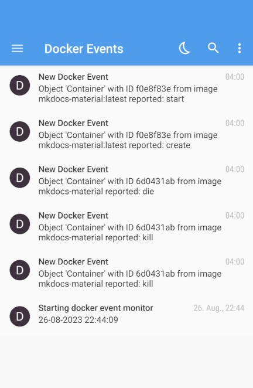

# Docker Event Monitor

Monitor Docker events and send push notifications for each event.



## Features

- Small memory and CPU footprint
- Pushover notification
- Gotify notification
- E-Mail notification (SMTP)
- Filter events

## Background

I've been using [Monocker](https://github.com/petersem/monocker) to monitor my Docker containers and get push notifications on status changes. However, it's using polling (with hard lower limit of 10 sec) to poll for status changes. This is too long to catch all status changes (e.g. watchtower updating an container). While I did remove the limit in my own Monocker fork, I noticed that the CPU usage goes up quite a bit for polling times < 1sec.
I needed another soultion, and found [docker-events-notifier](https://github.com/hasnat/docker-events-notifier), but Pushover integration was missing.

So I started to develop my own solution which ended up being a `bash` script doing exactly what I wanted it to do (you can still find it in `/legacy/`). However, the used `jq` caused CPU spikes for each processed event. As I could not find a good solution, I decied to write my own application and to learn something new - [Go](https://go.dev/).

As this is my first Go project there is certaily room for improvements (PR's welcome). It borrows heavily form [Dozzle](https://github.com/amir20/dozzle), which you should give a try if you haven't so far.

## Technical

The application uses Docker's API to connect to the [event stream](https://docs.docker.com/engine/api/v1.43/#tag/System/operation/SystemEvents). Each new event is procesed, logged and can be reported.

## Usage

The simplest way to use the docker event monitor is to run the docker container. It'a very small ( < 10MB) image. You can download it via

```shell
docker pull ghcr.io/yubiuser/docker-event-monitor:latest
```

### Docker compose

```yaml
version: '2.4'

services:
  docker-event-monitor:
    container_name: docker-event-monitor
    image: ghcr.io/yubiuser/docker-event-monitor:latest
    volumes:
      - /var/run/docker.sock:/var/run/docker.sock:ro
      - /etc/localtime:/etc/localtime:ro
    restart: unless-stopped
    environment:
      PUSHOVER: false
      PUSHOVER_USER: 'USER'
      PUSHOVER_APITOKEN: 'TOKEN'
      GOTIFY: false
      GOTIFY_URL: 'URL'
      GOTIFY_TOKEN: 'TOKEN'
      MAIL: false
      MAIL_FROM: 'your.username@provider.com'
      MAIL_TO: 'recipient@provider.com'
      MAIL_USER: 'USER'
      MAIL_PASSWORD: 'PASSWORD'
      MAIL_PORT: 587
      MAIL_HOST: 'smtp@provider.com'
      FILTER: 'event=start,event=stop,type=container'
      DELAY: '500ms'
      LOG_LEVEL: 'info'
```

### Build image locally

I provide a Dockerfile which will build the Docker image locally.

```shell
docker build -t docker-event-monitor:local .
```


### Build binary locally

If you have a suitable `Go` environment set up, you can build the binary from `/src/`. For development, a `devcontainer` with a suitable `Dockerfile` is provided as well.

### Environment variables and configuration

Configurations can use the CLI flags or environment variables. The table below outlines all supported options and their respective env vars.

| Flag                  | Env Variable            | Default | Details |
| ----------------      | ----------------------  | ------- |-------- |
| `--pushover`          | `PUSHOVER`              | `false` |Enable/Disable Pushover notification|
| `--pushoverapitoken`  | `PUSHOVER_APITOKEN`     | `""`    | |
| `--pushoveruserkey`   | `PUSHOVER_USER`         | `""`    | |
| `--delay`             | `DELAY`                 | `500ms` |Delay befor processing next event. Can be useful if messages arrive in wrong order |
| `--gotify`            | `GOTIFY`                | `false` |Enable/Disable Gotify notification|
| `--gotifyurl`         | `GOTIFY_URL`            | `""`    | |
| `--gotifytoken`       | `GOTIFY_TOKEN`          | `""`    | |
| `--mail`              | `MAIL`                  | `false` |Enable/Disable E-Mail (SMTP) notification|
| `--mailfrom`          | `MAIL_FROM`             | `""`    | `your.username@provider.com` |
| `--mailto`            | `MAIL_TO`               | `""`    | `recipient@provider.com` |
| `--mailuser`          | `MAIL_USER`             | `""`    | optional: SMTP username, set to `MAIL_FROM` if empty/unset |
| `--mailpassword`      | `MAIL_PASSWORD`         | `""`    | |
| `--mailport`          | `MAIL_PORT`             | `587`   | |
| `--mailhost`          | `MAIL_HOST`             | `""`    | `smtp@provider.com` |
| `--filter`            | `FILTER`                | `""`    | Filter events. Uses the same filters as `docker events` (see [here](https://docs.docker.com/engine/reference/commandline/events/#filter))    |
| `--loglevel`          | `LOG_LEVEL`             | `"info"`| Use `debug` for more verbose logging |
| `--servertag`         | `SERVER_TAG`            | `""`    | Prefix to include in the title of notifications. Useful when running docker-event-monitors on multiple machines |
